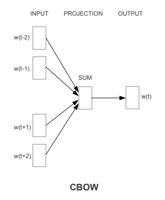

# CBOW (Continuous Bag of Words) model implementation in PyTorch
## Introduction 
This repository provides an implementation of CBOW model using PyTorch. CBOW is a a popular approach in natural language processing for predicting words in a context given the surrounding words.

## Model architecture

