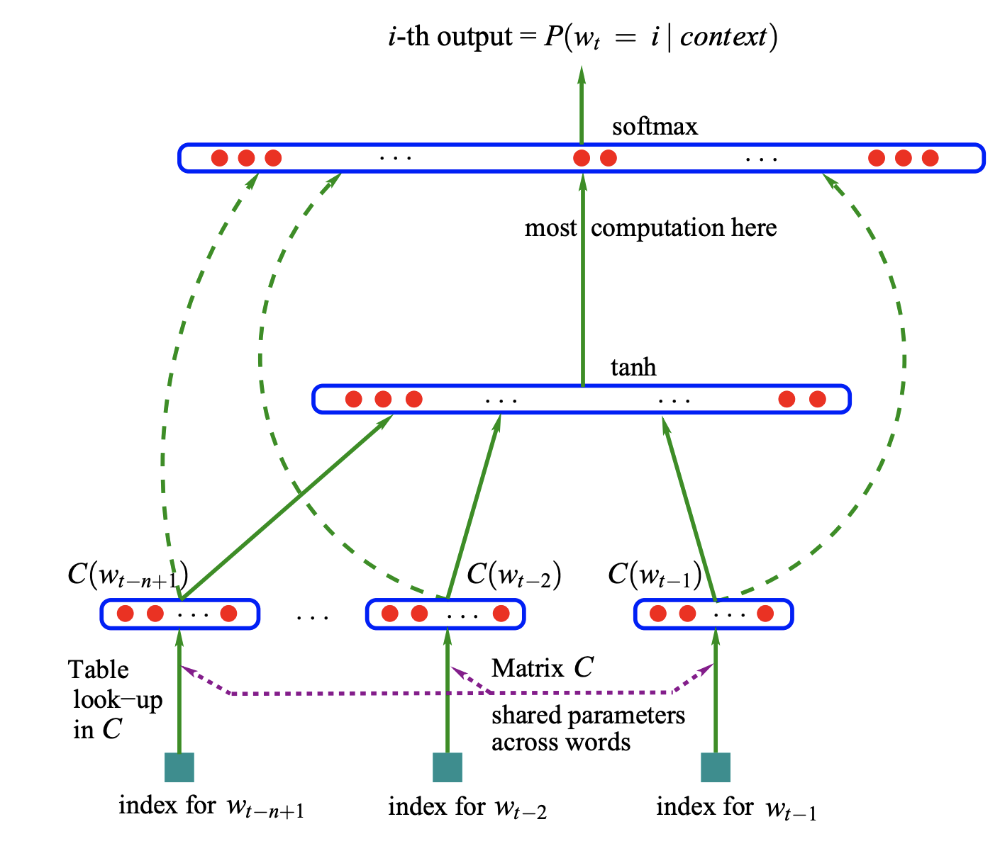

# Neural Probabilistic Language Model in PyTorch
## Introduction 
This repository provides an implementation of a Neural Probabilistic Language Model using PyTorch. A language model is a probability distribution over sequences of words, given some context. The goal of this project is to build a language model that can predict the next word in a sentence, based on the words that have come before it.

## Model architecture

